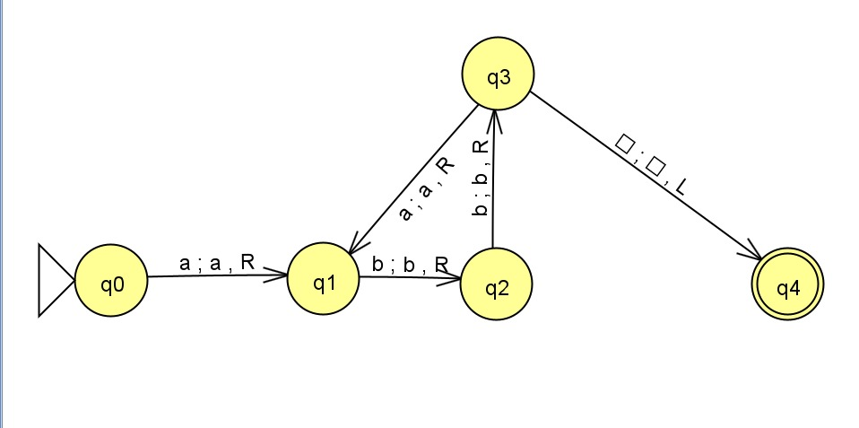

# Turing Machine Simulation with Graphical Interface

## Description

This project implements a **Turing Machine (TM)** in Python with a graphical interface developed using **Tkinter**. The TM validates strings that follow the pattern $(ab^2)^n$, where $n > 0$. The system allows the user to input strings, validate them, and visualize the results in an interactive table.

### Features:
- Validates strings that follow the pattern $(ab^2)^n$.
- Provides a graphical interface for entering strings and viewing results.
- Simulates the behavior of a TM with dynamic tape expansion and movement of the reading head.

## Requirements

To run the project, you need to have installed:

- **Python 3.x**
- **Tkinter** (pre-installed with most Python distributions)

## Installation

1. Clone this repository to your local machine:
    ```bash
    git clone https://github.com/JulianVic/MT-abb
    cd MT-abb
    ```

2. Ensure you have **Python** installed. If not, you can download it [here](https://www.python.org/downloads/).

3. Run the main project file:
    ```bash
    python main.py
    ```

## Usage

1. Run the main file. A window titled **MT abb** will appear.
2. Enter a string in the text field.
3. Click the **Validate** button.
4. The validation result (valid/invalid) will appear in the table.

### Examples of valid strings:

- `abb`
- `abbabb`
- `abbabbabb`

### Examples of invalid strings:

- `ab`
- `abbb`
- `aaabb`

## Turing Machine Diagram

Here is the Turing Machine diagram that follows the pattern $(ab^2)^n$:



## Technical Details

### Turing Machine
The TM is formally defined as a tuple $M = (Q, \Sigma, \Gamma, s, b, F, \delta)$, where:
- $Q = \{ q_0, q_1, q_2, q_3, q_4 \}$ is the finite set of states.
- $\Sigma = \{ a, b \}$ is the input alphabet.
- $\Gamma = \{ a, b, \textvisiblespace \}$ is the tape alphabet.
- $s = q_0$ is the initial state.
- $b = \textvisiblespace$ is the blank symbol.
- $F = \{ q_4 \}$ is the set of accepting states.
- $\delta$ is the transition function that processes the tape and moves the TM's head.

### Graphical Interface
The graphical interface was developed using Tkinter and provides a simple and intuitive user experience. The main functionalities are:
- A text field to input the string.
- A **Validate** button to run the TM and view results.
- A table that shows whether the entered strings are valid or not.

## Tests Performed

The system was tested with various strings to verify its correct operation:

- **Valid strings** like `abb` and `abbabb` were correctly validated.
- **Invalid strings** like `ab` and `abbb` were appropriately rejected.